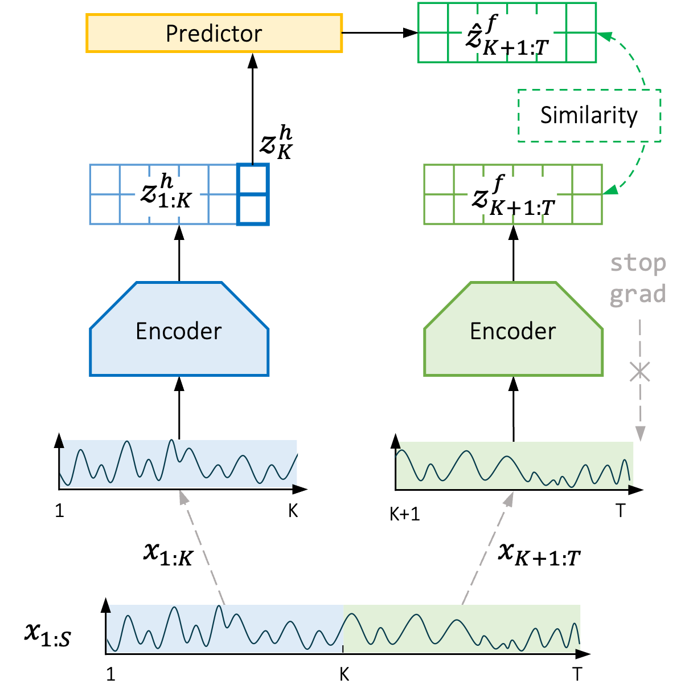

# SimTS: A PyTorch Implementation

<p align="center">
  
</p>

This is a PyTorch implementation of the paper [SimTS: Rethinking Contrastive Representation Learning for Time Series Forecasting](https://arxiv.org/abs/2303.18205):
```
@Article{SimTS2023,
    title={SimTS: Rethinking Contrastive Representation Learning for Time Series Forecasting},
    author={Zheng, Xiaochen and Chen, Xingyu and Sch{\"u}rch, Manuel and Mollaysa, Amina and Allam, Ahmed and Krauthammer, Michael},
    journal={arXiv preprint arXiv:2303.18205},
    year={2023}
}
```
# News
* Apr 19, 2023: Added hierarchical temporal loss from [TS2Vec](https://arxiv.org/abs/2106.10466) by [Alexander März](https://github.com/StatMixedML). Thanks, Alexander :tada: ! 
* Apr 11, 2023: Released codes for SimTS.

<details>
    <summary><b>More News</b></summary>
    <p>
        <ul>
            <li>Jun 30, 1905: Albert Einstein published the theory of special relativity in Annalen der Physik. </li>
        </ul>
    </p>
</details>
<br></br>

